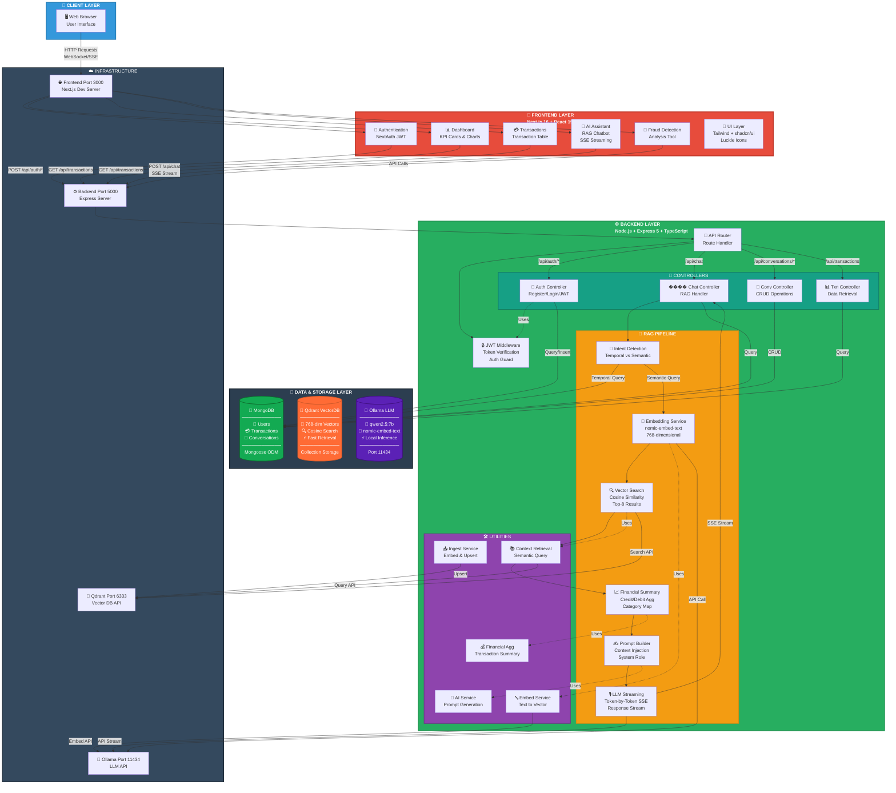

# 💰 RAG Finance Assistant

A full-stack personal finance web application powered by a **Retrieval-Augmented Generation (RAG)** AI chatbot. Users can view their financial dashboard, browse transactions, and chat with an AI assistant that answers questions based on their **actual transaction data**.

Transactions are embedded and stored in a **Qdrant vector database**, semantically retrieved per query, and injected as context into prompts sent to a local LLM via **Ollama**.

---

## 🏗️ Architecture Diagram

```
┌──────────────────────────────────────────────────────────────────────┐
│                          USER BROWSER                                │
│                                                                      │
│  ┌────────────────────────────────────────────────────────────────┐  │
│  │               Frontend (Next.js 16 + React 19)                 │  │
│  │                                                                │  │
│  │   /dashboard        → KPI Cards, Charts (Recharts)            │  │
│  │   /transactions     → Full Transaction Table                   │  │
│  │   /ai-assistant     → RAG Chatbot (SSE Streaming)             │  │
│  │   /fraud-detection  → Fraud Detection (stub)                  │  │
│  │                                                                │  │
│  │   Auth: NextAuth v4 (JWT)    Styling: Tailwind + shadcn/ui    │  │
│  └──────────────────────────────┬─────────────────────────────────┘  │
└─────────────────────────────────┼────────────────────────────────────┘
                                  │  HTTP / SSE
                                  ▼
┌─────────────────────────────────────────────────────────────────────────┐
│                     Backend (Node.js + Express 5)                       │
│                                                                         │
│   POST /api/auth/register          → Register user                     │
│   POST /api/auth/login             → Login, returns JWT                │
│   POST /api/chat                   → AI chat (RAG pipeline + SSE)      │
│   GET  /api/conversations          → List conversations                │
│   GET  /api/conversations/:id      → Get conversation                  │
│   POST /api/conversations          → Create conversation               │
│   DELETE /api/conversations/:id    → Delete conversation               │
│   GET  /api/transactions           → List transactions                 │
│                                                                         │
│   ┌─────────────────────────────────────────────────────────────┐      │
│   │                    RAG Pipeline                              │      │
│   │                                                              │      │
│   │   User Message                                               │      │
│   │        │                                                     │      │
│   │        ▼                                                     │      │
│   │   Intent Detection ──► Temporal? ──► MongoDB (date-sorted)   │      │
│   │        │                                                     │      │
│   │        ▼ (Semantic)                                          │      │
│   │   embedText() ──► 768-dim vector (nomic-embed-text)          │      │
│   │        │                                                     │      │
│   │        ▼                                                     │      │
│   │   Qdrant Search ──► Top-8 relevant transactions              │      │
│   │        │                                                     │      │
│   │        ▼                                                     │      │
│   │   Build Financial Summary + Prompt                           │      │
│   │        │                                                     │      │
│   │        ▼                                                     │      │
│   │   Ollama LLM (streaming) ──► SSE tokens to frontend          │      │
│   └─────────────────────────────────────────────────────────────┘      │
└────────────┬──────────────────┬──────────────────┬──────────────────────┘
             │                  │                  │
             ▼                  ▼                  ▼
      ┌────────────┐    ┌────────────┐     ┌────────────────┐
      │  MongoDB    │    │   Qdrant   │     │    Ollama      │
      │             │    │            │     │                │
      │ • Users     │    │ • 768-dim  │     │ • LLM:        │
      │ • Txns      │    │   vectors  │     │   qwen2.5:7b  │
      │ • Convos    │    │ • Cosine   │     │ • Embeddings: │
      │             │    │   search   │     │   nomic-embed  │
      └────────────┘    └────────────┘     └────────────────┘
```



---


## 📁 Folder Structure

```
rag-finance-assistant/
│
├── backend-node/
│   ├── .env                             # Backend environment variables
│   ├── package.json                     # Node.js dependencies
│   ├── server.js                        # Entry point — Express app, route registration
│   └── src/
│       ├── config/
│       │   ├── db.js                    # MongoDB connection (Mongoose)
│       │   └── qdrant.js               # Qdrant client + collection setup
│       ├── controllers/
│       │   ├── authController.js        # Register / Login logic
│       │   ├── chatController.js        # AI chat handler (RAG pipeline)
│       │   └── conversationController.js # CRUD for conversations
│       ├── middleware/
│       │   └── authMiddleware.js        # JWT verification middleware
│       ├── models/
│       │   ├── User.js                  # User schema (name, email, password)
│       │   ├── Transactions.js          # Transaction schema
│       │   └── Conversations.js         # Conversation + messages schema
│       ├── routes/
│       │   ├── authRoutes.js            # /api/auth/*
│       │   ├── chatRoutes.js            # /api/chat
│       │   ├── conversationRoutes.js    # /api/conversations/*
│       │   └── transactionRoutes.js     # /api/transactions/*
│       ├── scripts/
│       │   └── ingest.js               # Batch embed & upsert transactions into Qdrant
│       └── utils/
│           ├── aiService.js             # Prompt builder + Ollama LLM streaming
│           ├── embedService.js          # Text → 768-dim vector (nomic-embed-text)
│           ├── financialSummary.js      # Aggregate transactions → financial summary
│           ├── ingestTransactions.js    # Embed & upsert a single transaction to Qdrant
│           ├── intentDetector.js        # Temporal query detection (last/first N txns)
│           └── retrieveContext.js       # Semantic search in Qdrant (filtered by userId)
│
├── frontend/
│   ├── .env                             # Frontend environment variables
│   ├── package.json                     # Next.js dependencies
│   ├── next.config.ts                   # Next.js configuration
│   ├── tsconfig.json                    # TypeScript configuration
│   ├── postcss.config.mjs               # PostCSS (Tailwind)
│   ├── components.json                  # shadcn/ui configuration
│   ├── app/
│   │   ├── (auth)/                      # Login / Register pages
│   │   └── (root)/
│   │       ├── layout.tsx               # Root layout with Sidebar
│   │       ├── dashboard/               # Dashboard page (KPIs + charts)
│   │       ├── transactions/            # Transaction list page
│   │       ├── ai-assistant/            # AI Chatbot page
│   │       ├── fraud-detection/         # Fraud Detection page (stub)
│   │       └── app-settings/            # Settings page (stub)
│   ├── components/
│   │   ├── Sidebar.tsx                  # Collapsible nav sidebar + chat history
│   │   ├── ChatHistory.tsx              # Past AI conversations in sidebar
│   │   ├── CustomHeader.tsx             # Page header bar
│   │   ├── CustomStats.tsx              # KPI stat cards
│   │   └── assistant/
│   │       ├── MessageList.tsx          # Renders chat messages
│   │       └── ChatInput.tsx            # Chat text input
│   ├── contexts/
│   │   └── SidebarContext.tsx           # Global sidebar state (collapsed/expanded)
│   ├── constants/                       # Static/mock data constants
│   ├── lib/                             # Utility functions
│   ├── types/
│   │   └── chat.ts                      # TypeScript types for messages & conversations
│   └── public/                          # Static assets
│
├── PROJECT_SUMMARY.md                   # Detailed project documentation
└── README.md                            # This file
```

---

## 🧰 Tech Stack & Dependencies

### Backend

| Technology | Purpose | Version |
|---|---|---|
| **Node.js** | Runtime | v18+ |
| **Express** | HTTP framework | 5.x |
| **Mongoose** | MongoDB ODM | 9.x |
| **@qdrant/js-client-rest** | Qdrant vector DB client | 1.x |
| **Axios** | HTTP client (→ Ollama API) | 1.x |
| **jsonwebtoken** | JWT auth tokens | 9.x |
| **bcryptjs** | Password hashing | 3.x |
| **cors** | Cross-origin requests | 2.x |
| **dotenv** | Environment variables | 17.x |

### Frontend

| Technology | Purpose | Version |
|---|---|---|
| **Next.js** | React framework | 16.x |
| **React** | UI library | 19.x |
| **TypeScript** | Type safety | 5.x |
| **Tailwind CSS** | Styling | 4.x |
| **shadcn/ui + Radix UI** | Component library | — |
| **Recharts** | Charts (dashboard) | 3.x |
| **NextAuth** | Authentication (JWT) | 4.x |
| **Lucide React** | Icons | — |

### Infrastructure (External Services)

| Service | Purpose | Default URL |
|---|---|---|
| **MongoDB** | Primary database | `mongodb://localhost:27017` |
| **Qdrant** | Vector database | `http://localhost:6333` |
| **Ollama** | Local LLM + embeddings | `http://localhost:11434` |

---

## 📋 Prerequisites

Install these before running the project:

### 1. Node.js (v18+)
```bash
# Download from https://nodejs.org/
node --version    # verify: v18.x or higher
npm --version     # verify: 9.x or higher
```

### 2. MongoDB
```bash
# Option A: Install locally
# Download from https://www.mongodb.com/try/download/community

# Option B: Use Docker
docker run -d --name mongodb -p 27017:27017 mongo:latest

# Verify
mongosh --eval "db.runCommand({ ping: 1 })"
```

### 3. Qdrant (Vector Database)
```bash
# Using Docker (recommended)
docker run -d --name qdrant -p 6333:6333 -p 6334:6334 qdrant/qdrant:latest

# Verify
curl http://localhost:6333/dashboard
```

### 4. Ollama (Local LLM)
```bash
# Download from https://ollama.com/download

# Pull required models
ollama pull qwen2.5:7b          # LLM for chat responses
ollama pull nomic-embed-text     # Embedding model (768-dim)

# Verify
ollama list
```

---

## ⚙️ Environment Variables

### Backend — `backend-node/.env`

```env
# Server
PORT=5000

# MongoDB connection string
MONGODB_URI="Your_MONGODB_ATLAS_URI"

# JWT secret key (use a strong random string)
JWT_SECRET=your_jwt_secret_key_here

# Ollama API base URL
OLLAMA_URL=http://localhost:11434

# Backend URL (self-reference)
BACKEND_URL=http://localhost:5000
```

### Frontend — `frontend/.env`

```env
# Backend API URL
NEXT_PUBLIC_BACKEND_URL=http://localhost:5000

# NextAuth configuration
NEXTAUTH_URL=http://localhost:3000
NEXTAUTH_SECRET=your_nextauth_secret_key_here
```

---

## 🚀 Getting Started

### Step 1: Start External Services

```bash

# Terminal 1 — Qdrant
docker start qdrant

# Terminal 2 — Ollama (with performance tuning)
set OLLAMA_KEEP_ALIVE=-1
set OLLAMA_NUM_THREADS=8
set OLLAMA_MAX_LOADED_MODELS=2
ollama serve
```

### Step 2: Setup & Run Backend

```bash
# Terminal 4
cd backend-node

# Install dependencies
npm install

# Create .env file (see template above)
# Then start the server
node server.js    ||  npm run dev (install Nodemon)
```

You should see:
```
MongoDB Connected
Collection exists already.
Server running
```

### Step 3: Ingest Transactions into Qdrant

> **Run this once** after adding transactions to MongoDB. This embeds all transactions and upserts them into Qdrant for vector search.

```bash
# Terminal 5 (one-time operation)
cd backend-node
node src/scripts/ingest.js
```

You should see:
```
Found X transactions to ingest.
Ingestion Complete.
```

### Step 4: Setup & Run Frontend

```bash
# Terminal 6
cd frontend

# Install dependencies
npm install

# Start development server
npm run dev
```

You should see:
```
▲ Next.js 16.x
- Local: http://localhost:3000
```

### Step 5: Open the App

Navigate to **http://localhost:3000** in your browser.

1. **Sign up** a new account at `/sign-up`
2. **Sign in** at `/sign-in`
3. Go to **AI Assistant** and start chatting with your financial data

---

## 🖥️ Execution Commands Reference

| Action | Command | Directory |
|---|---|---|
| **Install backend deps** | `npm install` | `backend-node/` |
| **Start backend** | `node server.js` | `backend-node/` |
| **Ingest transactions** | `node src/scripts/ingest.js` | `backend-node/` |
| **Install frontend deps** | `npm install` | `frontend/` |
| **Start frontend (dev)** | `npm run dev` | `frontend/` |
| **Build frontend** | `npm run build` | `frontend/` |
| **Start frontend (prod)** | `npm run start` | `frontend/` |
<!-- | **Start MongoDB (Docker)** | `docker start mongodb` | anywhere | -->
| **Start Qdrant (Docker)** | `docker start qdrant` | anywhere |
| **Start Ollama** | `ollama serve` | anywhere |
| **Pull LLM model** | `ollama pull qwen2.5:7b` | anywhere |
| **Pull embedding model** | `ollama pull nomic-embed-text` | anywhere |
| **List Ollama models** | `ollama list` | anywhere |
| **Check loaded models** | `ollama ps` | anywhere |

---

## 🔧 Ollama Performance Tuning (CPU-only)

If running without a GPU, set these environment variables **before** starting Ollama:

```bash
set OLLAMA_KEEP_ALIVE=-1            # Keep model loaded in RAM permanently
set OLLAMA_NUM_THREADS=8            # Match your CPU core count
set OLLAMA_MAX_LOADED_MODELS=2      # Keep LLM + embedding model both loaded
ollama serve
```

### Recommended Models by Hardware

| Hardware | LLM Model | Expected Response Time |
|---|---|---|
| GPU (6GB+ VRAM) | `qwen2.5:7b` | ~3-8s |
| CPU (16GB+ RAM) | `qwen2.5:7b` | ~15-25s |
| CPU (8GB RAM) | `qwen2.5:3b` | ~10-15s |
| CPU (low-end) | `phi3:mini` | ~10-18s |

---

## 📡 API Endpoints

| Method | Endpoint | Auth | Description |
|---|---|---|---|
| `POST` | `/api/auth/sign-up` | Register a new user |
| `POST` | `/api/auth/sign-in` | Login, returns JWT token |
| `POST` | `/api/chat` | ✅ JWT | Send message to AI (SSE streaming response) |
| `GET` | `/api/conversations?userId=` | ✅ JWT | Get all conversations for a user |
| `GET` | `/api/conversations/:id` | ✅ JWT | Get a single conversation |
| `POST` | `/api/conversations` | ✅ JWT | Create a new conversation |
| `DELETE` | `/api/conversations/:id` | ✅ JWT | Delete a conversation |
| `GET` | `/api/transactions` | ✅ JWT | Get user transactions |

---

## 🧠 How RAG Works in This Project

```
User: "give me my last 5 transactions"
  │
  ├── Intent Detection → Temporal query detected (last 5)
  │     └── MongoDB: find().sort({ timestamp: -1 }).limit(5)
  │
  ├── Financial Summary built from last 100 transactions
  │     └── { totalCredit, totalDebit, balance, categoryMap, merchants }
  │
  ├── Prompt assembled: System Role + History + Financial Context + Instructions + Question
  │
  └── Ollama streams response token-by-token via SSE → Frontend renders live


User: "how much did I spend at Amazon?"
  │
  ├── Intent Detection → Not temporal, use semantic search
  │     └── embedText() → 768-dim vector
  │     └── Qdrant: cosine similarity search → top 8 relevant transactions
  │
  ├── Financial Summary built from last 100 transactions
  │
  ├── Prompt assembled with retrieved Amazon-related transactions
  │
  └── Ollama streams response via SSE → Frontend renders live
```

---

## 📄 License

This project is for educational and personal use.
